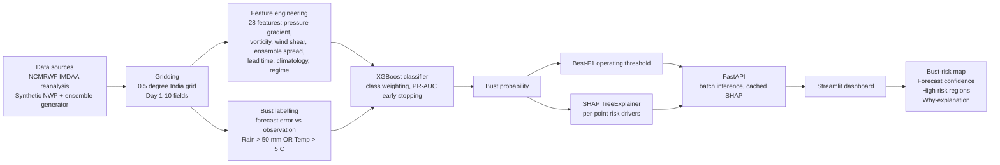

# BustGuard AI

Early-warning system that predicts when a medium-range (Day 1-10) weather forecast is likely to fail, before the failure is observed.

Smart India Hackathon 2026 | Problem Statement 26079 | Team Null Pointers
Theme: Smart Automation | Category: Software

---

## Problem

Medium-range numerical weather forecasts occasionally fail badly (a "forecast bust"): a large miss in temperature or rainfall that standard ensemble spread does not flag in advance. Forecasters currently find out after the fact. BustGuard AI estimates bust probability per grid point and lead day so that verification effort goes to the places and times that need it.

## What it does

- Scores every point on a 0.5 degree India grid for bust risk across lead days 1-10.
- Flags high-risk regions using a threshold tuned for the best precision/recall balance on validation data.
- Explains each prediction with SHAP, converted into a plain-English meteorological summary.
- Serves everything through a FastAPI backend and an interactive Streamlit dashboard.

## Bust definition

A forecast is a bust at a grid point if either condition holds:

| Variable | Condition |
|---|---|
| Maximum temperature | absolute error > 5 degrees C |
| Daily rainfall | absolute error > 50 mm |

Busts are rare (about 6-7% of cases), so the pipeline uses class weighting, PR-AUC early stopping and F1-based threshold tuning.

## Architecture



### Runtime behaviour

On startup the app loads the trained model and the processed dataset once, scores every grid point for every forecast cycle and lead day, and caches the result in memory. Dashboard interactions select slices of the cached results. Nothing is retrained at runtime.

## Data

The current prototype uses real NCMRWF IMDAA reanalysis for July-August 2019: daily maximum temperature, daily rainfall and 850 hPa winds, averaged onto a roughly 0.5 degree grid over India.

IMDAA contains observed weather, not forecasts. Until NCMRWF S2S forecasts are plugged in, the forecast under test is a **persistence** forecast (the weather on Day N equals today's weather), the standard baseline in forecast verification. The S2S ingestion pipeline is already built; swapping the source is the next stage.

A synthetic NWP and ensemble generator is also included, so the pipeline runs end to end without access to operational forecast feeds.

## Model

| Item | Detail |
|---|---|
| Algorithm | XGBoost (binary classifier) |
| Features | 28 engineered features |
| Imbalance handling | Class weighting, PR-AUC early stopping |
| Decision rule | Probability threshold chosen at best F1 on validation days |
| Explainability | SHAP TreeExplainer |

## Dashboard

### Sidebar controls

| Control | Function |
|---|---|
| Synoptic regime filter | Restricts forecast cycles to one weather situation (for example active monsoon trough, Bay of Bengal low). Labels come from a rule on central-India rainfall and Bay circulation, not an official IMD classification. |
| Forecast cycle | Selects the issue date. Cycles near the end of the dataset offer fewer lead days because verification needs observations. |
| Lead time | Selects Day 1-10, limited to days available for the chosen cycle. |
| Alert threshold | Probability above which a grid point is treated as a likely bust. Defaults to the model's best-F1 threshold. Affects summary cards and alert regions, not map colours. |
| Layer style | Heatmap (smooth surface) or grid points (hoverable sample). |
| Colour scale | Adaptive (stretches to the current range) or fixed 0-1 (comparable across lead days). |

### Summary cards

| Card | Definition |
|---|---|
| High-risk area | Share of India grid points at or above the alert threshold |
| Average system confidence | Mean of (1 - bust probability) x 100 across India |
| Alert regions | Number of zones (North, South, East, West, Central) with a meaningful share of flagged points |
| Dominant risk driver | Most common SHAP-identified driver among flagged points, computed live |

### Map and drill-down

- The risk surface is clipped to India's boundary (`app/assets/india_boundary.geojson`).
- Clicking the map selects the nearest grid point for inspection.
- The region selector opens on the lowest-confidence region and its highest-risk point.
- Waterfall and bar views show the same SHAP explanation: red factors raise risk, green factors lower it.
- A generated guidance sentence summarises the top factors, for example: "Confidence degraded to 18% primarily due to a sharp 1-day swing in maximum temperature and strong 850 hPa convergence, during an active monsoon trough over the Indo-Gangetic Plain."
- A confidence-versus-lead-time chart shows one line per zone, with the current lead day marked.

## Getting started

### Requirements

- Python 3.10+
- Dependencies listed in `requirements.txt`

### Install

```bash
git clone <repository-url>
cd <repository-directory>
pip install -r requirements.txt
```

### Run

Start the API (takes about 30 seconds to load), then the dashboard in a second terminal:

```bash
uvicorn app.api:app --reload
streamlit run app/dashboard.py
```

### Required artefacts

| Path | Purpose |
|---|---|
| `models/bust_detector.pkl` | Trained XGBoost model |
| `data/processed_features_real.parquet` | Processed IMDAA feature table |
| `app/assets/india_boundary.geojson` | India boundary for map clipping |

## Suggested demo

1. Open the first cycle at Day 1. The map is mostly calm and confidence is high.
2. Move the lead time to Day 9-10. Risk builds across the map and the confidence chart falls.
3. Change the forecast cycle or regime filter to show a different weather situation.
4. Click a red area on the map to open its live explanation.

## Limitations

- Probabilities are not calibrated. The model over-flags risk, so a point shown at 60% busts less than 60% of the time. Use the values to rank places and lead days, not as exact odds.
- The prototype is validated on a single two-month window (July-August 2019) against a persistence baseline, not operational NWP forecasts.
- Regime labels are rule-based and are not an IMD product.
- This is a prototype, not an official MoES or NCMRWF product.

## Roadmap

- Replace persistence with NCMRWF S2S model forecasts (ingestion pipeline already built).
- Calibrate probabilities (isotonic or Platt scaling).
- Extend training data beyond one monsoon window.
- Automated alerting and live feed integration.

## Tech stack

Python, Pandas, NumPy, XGBoost, SHAP, FastAPI, Streamlit

## References

1. M. S. Roulston, "A comparison of predictors of the error of weather forecasts", Nonlinear Processes in Geophysics. https://doi.org/10.5194/npg-12-1021-2005
2. M. J. Rodwell et al., "Characteristics of Occasional Poor Medium-Range Weather Forecasts for Europe", Bulletin of the American Meteorological Society. https://doi.org/10.1175/BAMS-D-12-00099.1
3. C. M. Grams, L. Magnusson, E. Madonna, "An atmospheric dynamics perspective on the amplification and propagation of forecast error in numerical weather prediction models: A case study", Quarterly Journal of the Royal Meteorological Society. https://doi.org/10.1002/qj.3353
4. F. Uno et al., "A diagnostic for advance detection of forecast busts of regional surface solar radiation using multi-center grand ensemble forecasts", Solar Energy. https://doi.org/10.1016/j.solener.2017.12.060
5. C. K. Potvin et al., "Using Machine Learning to Predict Convection-Allowing Ensemble Forecast Skill: Evaluation with the NSSL Warn-on-Forecast System", Artificial Intelligence for the Earth Systems. https://doi.org/10.1175/AIES-D-23-0106.1

## Team

Null Pointers, Smart India Hackathon 2026
